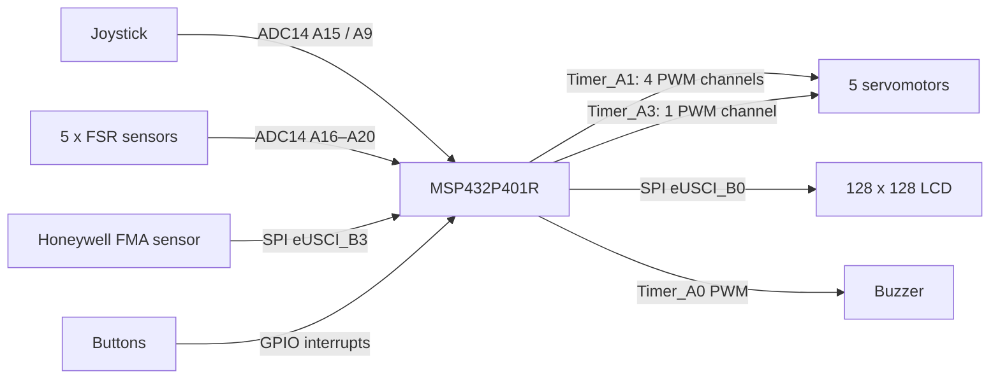

# DFRobot hand architecture

This diagram is an original portfolio reconstruction from the reviewed firmware. It does not reproduce vendor or internal UTC artwork.

## Control path

The MSP432 directly generates the five servo commands. The reviewed firmware uses a 20 ms PWM period (50 Hz) and constrains command pulse widths to approximately 1000–1600 µs.

The joystick and FSR inputs are prototype-specific mappings to servo commands. The FMA sensor is read digitally over SPI. The firmware does not use measured finger-position feedback, so this architecture is described as open-loop servo commanding rather than closed-loop finger-position control.
