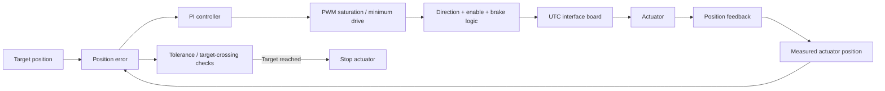

# UTC hand PI position-control loop

The diagram below represents the control logic implemented in the reviewed UTC-hand firmware at a public-safe level.

## Implemented control elements

The reviewed firmware contains proportional and integral terms, integral limiting/reset behavior, output limiting, direction selection, position tolerance and target-crossing checks.

The gains and limits were tuned for the academic prototype. The preserved project material does not provide quantitative closed-loop benchmarks such as settling time, overshoot or repeatability, so those metrics are intentionally not inferred from this diagram.
