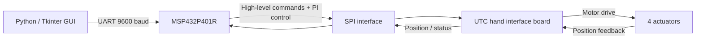

# UTC robotic-hand architecture

This is an original public-safe reconstruction from the reviewed project code and final academic documentation. Board-specific register-map and low-level protocol details are intentionally omitted.

## Control path

The PC sends newline-terminated text commands to the MSP432 over UART. For position movements, the MSP432 reads actuator positions through the dedicated interface board, computes the PI control command, and exchanges motor-control values with the board over SPI.

The documented commands include `WHOAMI`, `POS`, `STATUS`, `OPEN`, `MID`, `CLOSE`, `DEMO` and `STOP`. The software `STOP` command is not represented as an independently validated emergency stop because the reviewed movement routines are blocking.

SysTick is configured for nominal 200 Hz scheduling in the reviewed firmware. The effective end-to-end closed-loop update rate was not measured, so this diagram does not attach a measured frequency to the full control loop.
